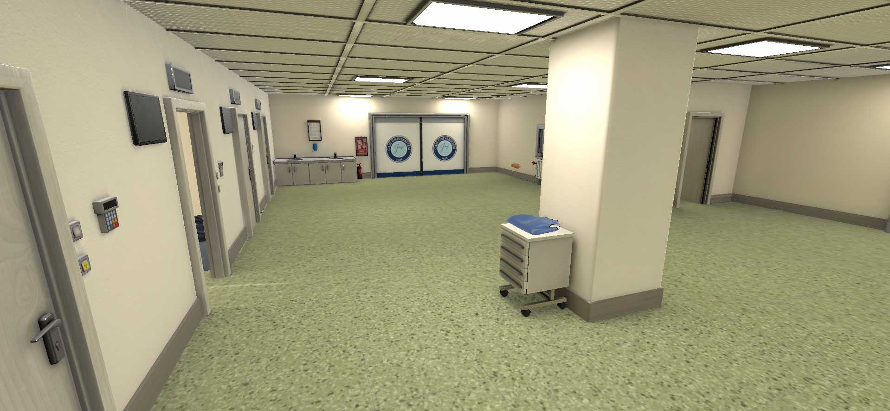
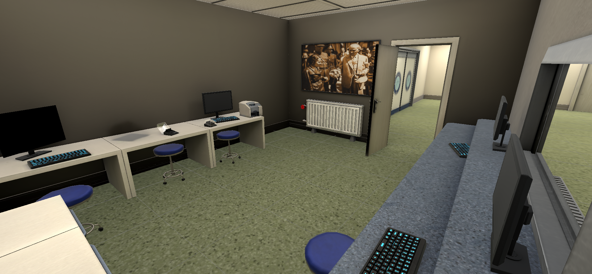
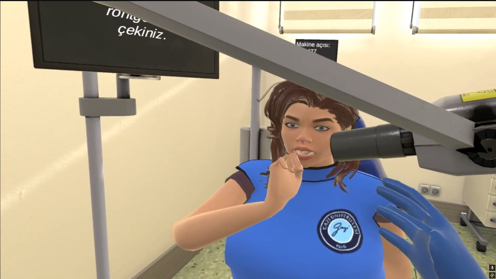
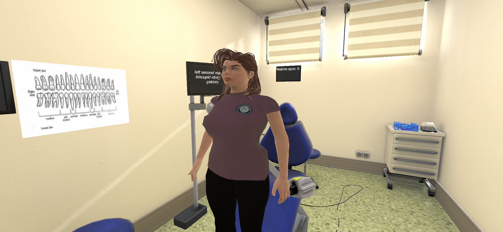
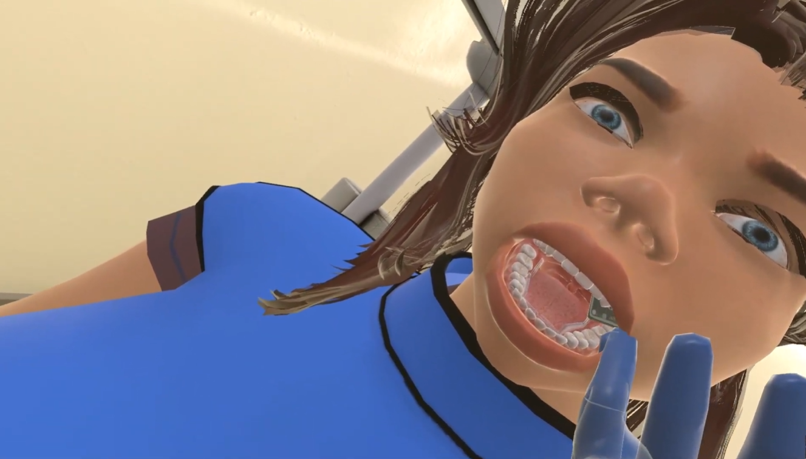
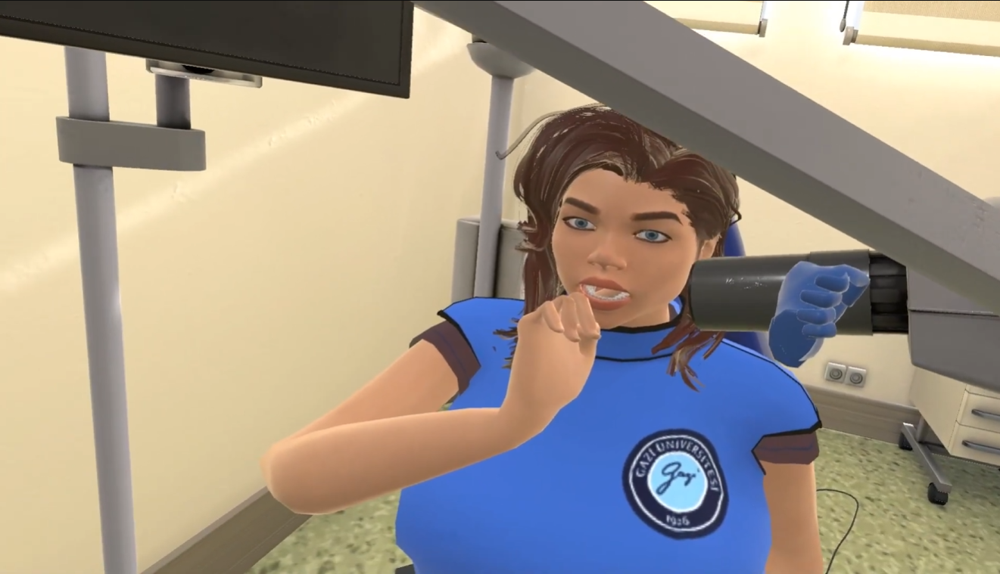
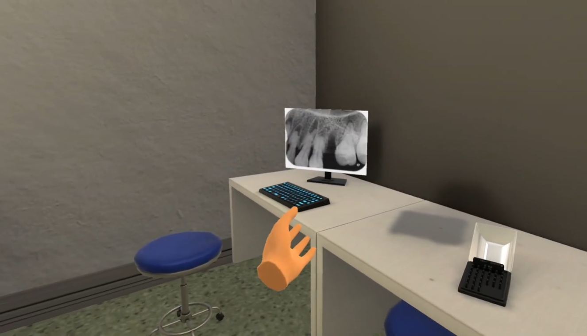

## Gazi Üniversitesi Diş Hekimliği VR Simülasyonu

Bu proje, Gazi Üniversitesi Bilişim Enstitüsü tarafından Gazi Üniversitesi Diş Hekimliği Fakültesi için geliştirilmiş diş hekimliği radyolojisi eğitim simülasyonudur. Bu VR simülasyonu ile radyoloji süreçleri dijital ortama aktarılmış, Gazi Üniversitesi Diş Hekimliği Fakültesi radyoloji bölümü bire bir modellenerek dijital ikizi oluşturulmuştur.

---

### Amaç

- **Eğitim odaklı simülasyon**: Diş hekimliği radyolojisindeki temel klinik adımları sanal ortamda güvenli şekilde uygulama imkânı sunar.
- **Gerçeğe yakın ortam**: Radyoloji odasının mekânsal yerleşimi, cihazlar ve hasta-hekim etkileşimleri gerçekçi şekilde modellenmiştir.
- **Tekrar edilebilir senaryolar**: Öğrencilerin, radyasyon güvenliği ve doğru görüntü alma süreçlerini defalarca deneyimleyebilmesini sağlar.

---

### Senaryo Akışı

Simülasyon içinde takip edilmesi gereken temel adımlar aşağıdaki gibidir:

1. **Hastaya radyasyon önleyici kurşun yeleği giydir.**
2. **Eldivenleri giy.**
3. **Diş filmini al ve hastanın ağız içine doğru şekilde yerleştir.**
4. **Röntgen cihazını diş filmine göre doğru açıda ve doğru konumda hizala.**
5. **Odadan dışarı çık ve röntgen çekme düğmesine bas.**
6. **Hastanın ağzından diş filmini al ve koruyucu kılıfını çıkar.**
7. **Diş filminin dış (atık) kısmını ayır ve çöpe at.**
8. **Diş filmini bilgisayara yerleştir.**
9. **Elde edilen radyografik görüntüleri ekrandan kontrol et.**

Bu adımlar, hem **radyasyon güvenliği** hem de **doğru radyografik görüntü elde etme** süreçlerini pratik etmek için tasarlanmıştır.

---

### Kurulum

> **Not:** Projenin derlenmiş sürümü (`.zip`) GitHub **Releases** bölümünde paylaşılacaktır.

1. **Zip dosyasını indirin.**
   - GitHub deposunda `Releases` sekmesine gidin.
   - Projenin en güncel sürümüne ait `.zip` dosyasını indirin.

2. **Dosyaları çıkarın.**
   - İndirdiğiniz `.zip` dosyasına sağ tıklayın.
   - "Tümünü ayıkla / Extract All" ile istediğiniz bir klasöre çıkarın.

3. **Uygulamayı çalıştırın.**
   - Ayıklanan klasör içinde yer alan `*.exe` dosyasını bulun.
   - `exe` dosyasına çift tıklayarak simülasyonu başlatın.
   - Ekstra bir kurulum adımı gerekmemektedir.

---

### Sistem Gereksinimleri (Önerilen)

Aşağıdaki değerler, tipik bir VR uygulaması için **önerilen** gereksinimleri temsil eder. Projenize göre gerekirse düzenleyebilirsiniz:

- **İşletim Sistemi**: Windows 10 veya üzeri (64-bit)
- **İşlemci (CPU)**: Intel i5 / AMD Ryzen 5 veya üzeri
- **Bellek (RAM)**: En az 8 GB (önerilen 16 GB)
- **Ekran Kartı (GPU)**: VR uyumlu ekran kartı (Örn: NVIDIA GTX 1060 / AMD eşdeğeri veya üzeri)
- **Depolama**: En az 500 MB boş disk alanı
- **VR Donanımı**: Uygun VR gözlüğü ve kontrolcüleri (Meta / HTC / benzeri)

---

### Kullanım

- **VR gözlüğü ve kontrolcüler**:
  - Simülasyondaki tüm etkileşimler VR kontrolcüleri ile gerçekleştirilir (nesne tutma, yerleştirme, düğmeye basma vb.).
- **Senaryo takibi**:
  - Ekrandaki veya ortam içindeki yönlendirmeleri takip ederek 1'den 9'a kadar olan adımları sırasıyla uygulayın.
  - Adımları eksik ya da hatalı yaptığınızda geribildirim almanız mümkün olacak şekilde senaryo tasarlanmıştır (proje kurgunuza göre uyarlayabilirsiniz).

---

### Video

Simülasyonun kısa tanıtım videosuna aşağıdaki bağlantıdan ulaşabilirsiniz:

- **Simülasyon tanıtım videosu**: [`https://youtu.be/MRmvmYqhpGY?si=3bFTlWJLOMn3rbq4`](https://youtu.be/MRmvmYqhpGY?si=3bFTlWJLOMn3rbq4)

---

### Ekran Görüntüleri

---

### İletişim ve Katkı

- **Geliştiren kurum**: Gazi Üniversitesi Bilişim Enstitüsü
- **Kullanım alanı**: Gazi Üniversitesi Diş Hekimliği Fakültesi – Diş Hekimliği Radyolojisi eğitimi

Geri bildirimleriniz, senaryo iyileştirmeleri veya teknik sorularınız için lütfen proje deposu üzerinden `Issues` oluşturun veya proje ekibi ile iletişime geçin.

